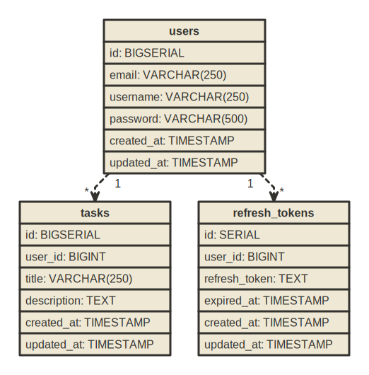

# Task CRUD Application

A simple CRUD application built with the [Gin](https://gin-gonic.com/) framework in Go. It includes authentication (JWT), task management endpoints, and comes with a full Docker-based setup for the database and migrations.

---

## Live Version

A live version is available for demonstration and testing purposes at:  
[https://task-crud.ridhoafwani.dev/swagger/index.html](https://task-crud.ridhoafwani.dev/swagger/index.html).

**Note:** To use bearer token in swagger you can read here : [Bearer token in Swagger](#bearer-token-in-swagger)

---

## Table of Contents

- [Task CRUD Application](#task-crud-application)
  - [Live Version](#live-version)
  - [Table of Contents](#table-of-contents)
  - [Bringing up the entire stack with docker-compose](#bringing-up-the-entire-stack-with-docker-compose)
  - [Getting Started](#getting-started)
    - [Prerequisites](#prerequisites)
    - [Environment Variables](#environment-variables)
    - [Setup Database](#setup-database)
    - [Migrations](#migrations)
    - [Running the Application](#running-the-application)
  - [Authentication](#authentication)
    - [Registering a User](#registering-a-user)
    - [Logging In and Obtaining a JWT](#logging-in-and-obtaining-a-jwt)
    - [Using the JWT Token](#using-the-jwt-token)
    - [Bearer token in Swagger](#bearer-token-in-swagger)
  - [API Endpoints](#api-endpoints)
  - [Makefile Commands](#makefile-commands)
  - [Docker Integration](#docker-integration)
  - [Database Schema](#database-schema)
    - [Tables](#tables)
      - [users](#users)
      - [tasks](#tasks)
      - [refresh_tokens](#refresh_tokens)
    - [Relationships](#relationships)
  - [Swagger Documentation](#swagger-documentation)

---

## Bringing up the entire stack with docker-compose

**You need to setup your .env file first, read here : [Environment Variables](#environment-variables)**

You can use docker-compose to bring up the entire stack (database, migrations, app) with a single command:

```bash
docker-compose up --build -d
```

This will create a `db` service using the variables defined in your `.env` file.

## Getting Started

### Prerequisites

- Go (version 1.16 or later)
- Git
- [Docker](https://www.docker.com/) and [Docker Compose](https://docs.docker.com/compose/) if you want to run the database and migrations easily without installing PostgreSQL locally.

### Environment Variables

The application reads configuration from a `.env` file. An example file `.env.example` is provided. Copy it and update as needed:

```bash
cp .env.example .env
```

The most important variables are:

- **PORT:** The port on which the application runs (default `3000`).
- **DB_HOST, DB_PORT, DB_DATABASE, DB_USER, DB_PASSWORD:** Database connection details.
- **JWT_SECRET_KEY:** The secret key used for signing JWT tokens.

If you are running with Docker, ensure `DB_HOST` is set to `db`. If running locally without Docker, set it to `localhost`.

### Setup Database

You have two main options to set up the database:

1. **Using Docker and Docker Compose (Recommended):**  
   Run the following command to start the PostgreSQL database in a container:

   ```bash
   docker-compose up -d db
   ```

   This will create a `db` service using the variables defined in your `.env` file.

2. **Running PostgreSQL Locally:**  
   Install and run PostgreSQL on your machine, then update your `.env` file accordingly:
   ```bash
   DB_HOST=localhost
   DB_USER=root
   DB_PASSWORD=secret
   DB_DATABASE=taskcrud
   DB_PORT=5432
   ```
   After setting the correct variables, create the database if it doesn't exist:
   ```bash
   createdb -h localhost -p 5432 -U root taskcrud
   ```

### Migrations

Migrations are managed using [golang-migrate](https://github.com/golang-migrate/migrate). The migration files are located in `scripts/migrations`.

**If using Docker Compose:**  
Migrations will run automatically when the `migrate` service is started. Simply run:

```bash
docker-compose up --build -d
```

This command brings up `db`, runs migrations (`migrate` service), and then starts the `app` service.

**If running locally:**  
Install [migrate](https://github.com/golang-migrate/migrate/tree/master/cmd/migrate) and then run:

```bash
make migrate-up
```

This uses the `POSTGRESQL_URL` constructed in the `Makefile` to apply all pending migrations.

To roll back migrations:

```bash
make migrate-down
```

### Running the Application

**Locally (without Docker):**

1. Ensure `.env` is configured.
2. Build and run the application:

   ```bash
   make build
   make run
   ```

   Or use Go directly:

   ```bash
   go build -o main cmd/main.go
   ./main
   ```

   The application should now be running on `http://localhost:3000`.

**With Docker Compose:**

```bash
docker-compose up --build -d
```

Once the containers are up, the application will be accessible at `http://localhost:3000`.

---

## Authentication

This project uses JWT-based authentication. You must first register a user, then log in to receive a JWT token, which you will use for subsequent authenticated requests.

### Registering a User

To register a new user, send a `POST` request to the registration endpoint. Example using `curl`:

```bash
curl -X POST http://localhost:3000/api/v1/auth/register \
  -H "Content-Type: application/json" \
  -d '{
        "username": "testuser",
        "password": "password123"
      }'
```

You should receive a response confirming the user registration.

### Logging In and Obtaining a JWT

After registration, log in to obtain a JWT:

```bash
curl -X POST http://localhost:3000/api/v1/auth/login \
  -H "Content-Type: application/json" \
  -d '{
        "username": "testuser",
        "password": "password123"
      }'
```

The response will include a `token` field. Save this token for subsequent requests.

### Using the JWT Token

For protected endpoints (e.g., creating, updating, or deleting tasks), include the JWT in the `Authorization` header:

```bash
curl -X GET http://localhost:3000/api/v1/tasks \
  -H "Authorization: Bearer <your_jwt_token_here>"
```

Replace `<your_jwt_token_here>` with the token obtained during login.

### Bearer token in Swagger

If you are using Swagger to test your API, you can use the `Authorize` button to add the Bearer token to the request header with format `Bearer <your_jwt_token_here>`.

---

## API Endpoints

**Public Endpoints:**

- `POST /api/v1/auth/register`: Register a new user.
- `POST /api/v1/auth/login`: Log in and receive a JWT.

**Protected Endpoints (Require JWT):**

- `POST /api/v1/auth/refresh`: Refresh a user's access token.

  **Task Endpoints**

- `GET /api/v1/tasks`: Get all tasks
- `POST /api/v1/tasks`: Create a new task
- `GET /api/v1/tasks/{id}`: Get a specific task
- `PATCH /api/v1/tasks/{id}`: Update a specific task
- `DELETE /api/v1/tasks/{id}`: Delete a specific task

---

## Makefile Commands

**Build the application:**

```bash
make build
```

**Run the application:**

```bash
make run
```

**Watch mode with live reload (requires [air](https://github.com/cosmtrek/air)):**

```bash
make watch
```

**Migrations:**

- Create a new migration file:
  ```bash
  make migrate-create name=add_new_table
  ```
- Run migrations:
  ```bash
  make migrate-up
  ```
- Roll back migrations:
  ```bash
  make migrate-down
  ```

**Generate Swagger docs:**

```bash
make swag
```

---

## Docker Integration

**Bringing up the entire stack (Database, Migrations, App):**

```bash
docker-compose up --build -d
```

**Stopping the containers:**

```bash
docker-compose down
```

**Viewing logs:**

```bash
docker-compose logs -f
```

---

## Database Schema

Below is a representation of the database schema based on the provided SQL migration.



### Tables

#### users

- **id**: BIGSERIAL PRIMARY KEY
- **email**: VARCHAR(250) NOT NULL UNIQUE
- **username**: VARCHAR(250) NOT NULL
- **password**: VARCHAR(500) NOT NULL
- **created_at**: TIMESTAMP NOT NULL DEFAULT CURRENT_TIMESTAMP
- **updated_at**: TIMESTAMP NOT NULL DEFAULT CURRENT_TIMESTAMP

#### tasks

- **id**: BIGSERIAL PRIMARY KEY
- **user_id**: BIGINT NOT NULL REFERENCES users(id)
- **title**: VARCHAR(250) NOT NULL
- **description**: TEXT NOT NULL
- **created_at**: TIMESTAMP NOT NULL DEFAULT CURRENT_TIMESTAMP
- **updated_at**: TIMESTAMP NOT NULL DEFAULT CURRENT_TIMESTAMP

#### refresh_tokens

- **id**: SERIAL PRIMARY KEY
- **user_id**: BIGINT NOT NULL REFERENCES users(id)
- **refresh_token**: TEXT NOT NULL
- **expired_at**: TIMESTAMP NOT NULL
- **created_at**: TIMESTAMP NOT NULL DEFAULT CURRENT_TIMESTAMP
- **updated_at**: TIMESTAMP NOT NULL DEFAULT CURRENT_TIMESTAMP

### Relationships

- **users** to **tasks**: One-to-Many  
  A single user (users.id) can have many tasks (tasks.user_id).

- **users** to **refresh_tokens**: One-to-Many  
  A single user (users.id) can have many refresh tokens (refresh_tokens.user_id).

---

## Swagger Documentation

When running the application (via Docker or locally), you can view the API documentation at:  
[http://localhost:3000/swagger/index.html](http://localhost:3000/swagger/index.html)
